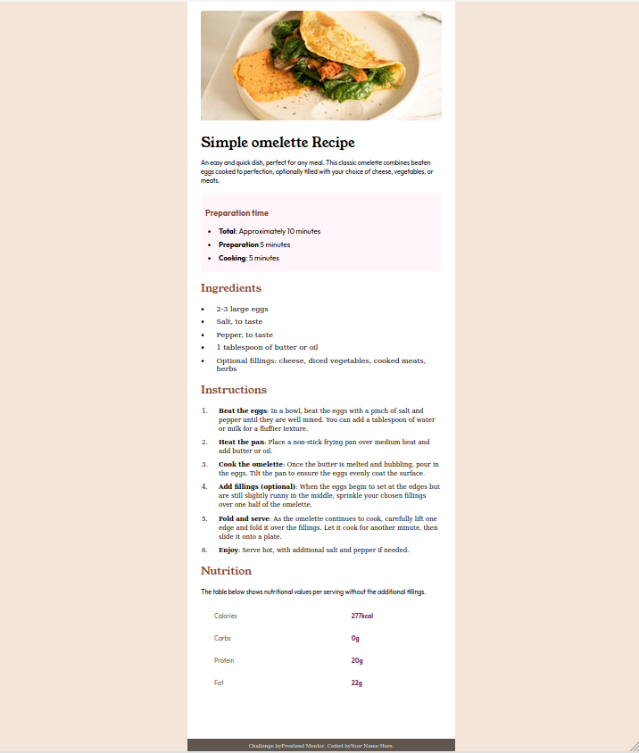
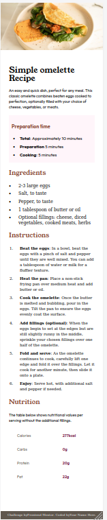

# Frontend Mentor - Recipe page solution

This is a solution to the [Recipe page challenge on Frontend Mentor](https://www.frontendmentor.io/challenges/recipe-page-KiTsR8QQKm). Frontend Mentor challenges help you improve your coding skills by building realistic projects. 

## Table of contents

- [Overview](#overview)
  - [The challenge](#the-challenge)
  - [Screenshot](#screenshot)
  - [Links](#links)
- [My process](#my-process)
  - [Built with](#built-with)
  - [What I learned](#what-i-learned)
  - [Continued development](#continued-development)
- [Author](#author)

## Overview

### Screenshot

### Links

- Solution URL: [Github repo](https://github.com/mbalali63/Recipe-page.git)
- Live Site URL: [you can see my design here.](https://recipe-page-m0d.pages.dev/)

## My process

### Built with

- Semantic HTML5 markup
- CSS custom properties
- Flexbox

### What I learned

In this project I practiced styling and creating a good structure for HTML. I don't use any special tool, and do it only by pure HTML-CSS.
In this project I tried to use semantic elements.

### Continued development

I will use more advanced tools like tailwind-css for other projects.

## Author

- Frontend Mentor - [@mbalali63](https://www.frontendmentor.io/profile/mbalali63)
- Twitter - [@codinggeek1984](https://www.twitter.com/codinggeek1984)

